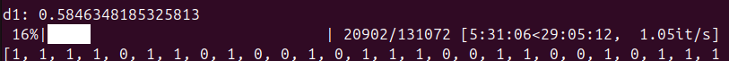

# Binary-Encodings2

## Description

> Were all those outputs in the previous challenge really so neccesary?

We are presented with a simple Python script that has been run for us:

```python
from Crypto.Util.number import getPrime
import os

def binarify(m):
    return int.from_bytes(bin(int.from_bytes(m, "big")).encode(), "big")

with open("flag.txt", "rb") as f:
    flag = f.read()

assert flag.startswith(b'DDC{') and flag.endswith(b'}')
assert len(flag) == 18

with open("output.txt", "w") as f:
    for i in range(2):
        p = getPrime(64)
        f.write(f'p_{i} = {p}\n')
        f.write(f'f_{i} = {binarify(flag) % p}\n')
```

and the output of it.

## First look

(This part is mostly the same as for Binary-Encodings1)

The script does an odd transformation to the flag: it converts the flag to an integer, takes its binary digits, then converts the corresponding string to an integer.
All in all, the process is perfectly reversible, but creates lots of redundant data (the last string must begin with `0b1` and contain only the characters `0` and `1`).

For the output, we are given two samples of the resulting integer modulo a 64-bit prime. Thus, we have about 128 bits of data to work with; given that the flag is 18 bytes with 5 bytes known, there are about 104 unknown bits of data left to recover - just on the edge of what what was given.

There don't seem to be any obvious blunders in the code, and since it is quite short (and labelled as a _cryptography_ challenge), it seems that we have to solve the given problem directly.

## Cleaning the input

The first step seems quite straightforward (and uses part of the idea for Binary-Encodings1): combine the info from the two different samples into a single one. Using CRT, we can easily find the value of `binarify(flag)` modulo the product of the two primes:

```python
from sage.all import crt

ps = []
qs = []
n = 1
with open("output.txt") as f:
    while True:
        l = f.readline().strip()
        if l == "":
            break
        ps.append(int(l.split()[-1]))
        l = f.readline().strip()
        qs.append(int(l.split()[-1]))
        n *= ps[-1]

base: int = crt(qs, ps)
```

Now, almost all the information we have is encoded in `base` and `n`. It is worth to keep in mind that we also have the factors of `n`, but that doesn't seem too important for now.

Let's also remove the redundant data. Since we are given a prefix of the target string, we don't have to worry about how long the resulting string is.
Let's consider the case where all the unknown bits are zeros and subtract the rest:

```python
def binarify(m):
    return int.from_bytes(bin(int.from_bytes(m, "big")).encode(), "big")

template = b"DDC{" + b"\0" * 13 + b"}"
assert len(template) == 18

bin_base = binarify(template) % n
```

Now `base - bin_base` is precisely the interesting part (modulo `n`).

## Rephrasing the problem

Since each bit of the flag affects a fixed byte in the binary representation, the resulting target now consists of the sum of the differences for bytes that we "guessed wrong".
Namely, since we assumed all unknown bits are zeros, the sum is made up of the differences between that byte being the character `0` versus it being the character `1`.
(This difference ends up being exactly 1, but that actually doesn't matter.)

If we want to change our guess and change a zero bit to a one bit, all we have to do is add a constant corresponding to that bit.
Thus, the target sum `base - bin_base` is exactly the sum of some of these constants (modulo `n`).

We have reached a problem that seems quite general:

> Given a list of values, a target number and a number `n`, select some of the values such that their sum is equal to the target modulo `n`.

Indeed, this is the _modular subset sum_ problem.
A better-documented variant is the regular subset sum problem (SSP), which just omits the "modulo `n`" part.
However, as can handily be checked on Wikipedia, the SSP is NP-complete - any known full solution essentially uses time exponential in the number / size of the inputs (in this case, the number of values to choose from and the logarithm of the target value).

Let's put a cap on exactly how hard our problem is.
As a somewhat generous assumption, we can take that the flag only consists of ASCII characters, meaning that the highest bit of each byte is zero.
This reduces the number of unknown bits to `13 * 7 = 91`.

## Trying without success

Feel free to skip this part if you are looking for the working solution.
However, we will use _some_ of these ideas.

### Plain brute-force

We could just bite the bullet and try all subsets of values.
This would be `2^91` combinations to check.
As a good rule of thumb, a normal computer can't do more than about 10^9 useful computations in a second, and using multiprocessing we can expect to the order of 10 times speedup (or 100, if that's where we're at). Let's have python tell us the bad news: how many hours of computation?

```python-repl
>>> 2**91 / (10**9 * 10) / 60 / 60
68774446626965.58
```

Nope.

However, we can always reduce the number of bits that we have to solve for, using brute force.
If nothing else, this can help parallellize the computation later.

### Meet in the middle

Several exponential-time algorithms can be significantly sped up by using meet in the middle.
In this case, we could compute just the sums of the `2^45` subsets of the first 45 bits, then separately compute the sums of the subsets of the last 46 bits and check whether `target - current_sum` (modulo `n`) is in the first bucket of values we calculated - if so, we've found the last 46 bits, and the rest should be no problem.

This would take about 2^46 computations (yes, ignoring lookups), so:

```python-repl
>>> 2**46 / (10**9 * 10) / 60 / 60
1.9546873382684447
```

2 hours seems quite manageable, even if we're off by an order of magnitude (i.e. ~20 hours).
However, all of the 2^45 precomputed values need to go somewhere - how much memory does that use?

```python-repl
>>> 2**45 / 1000**3
35184.372088832
```
...that's 35 terabytes.
Wait, no, each number uses 128 bits, so 16 bytes:

```python-repl
>>> 2**45 * 16 / 1000**3
562949.953421312
```

563 terabytes. Yikes.

We could reduce the memory use by shifting the weight towards the second computation, which does not use memory. We could manage with about 70 hours of computation, but that would only reduce the space use about 35 times - still over 10 terabytes.
If you have that kind of RAM lying around, I guess that's an option, but doing all the lookups on such a huge range of values will add at least one order of magnitude to the total amount of computation, which would use too much time.
Using SSDs, the orders of magnitude pile up even more.

### Character set?

We could restrict the characters used to the "normal" ASCII characters.
This feels quite cheesy, but could help get the time just small enough.

Let's use the following alphabet:

```python
alphabet = b'0123456789abcdefghijklmnopqrstuvwxyzABCDEFGHIJKLMNOPQRSTUVWXYZ_!#$%&,-.:;?@^|~'
```

That's just 78 characters instead of the 128 we allow with all 7 bits changing.
Let's see what the theoretical speedup is:

```python-repl
>>> (2**7 / len(alphabet))**(18-5)
625.8925330948902
```

That's just two orders of magnitude.
Assuming the best conditions and a lot of time, this _could_ already be used to implement the previous attack, but this still seems quite absurd.

### Words?

Going even more cheesy, flags tend to contain words.
These are usually encoded in leetspeak and what not, but even then most combinations of characters don't form words, so even isolating a single one could reduce the running time a couple of times.
However, even assuming that there is a short word in the flag, there is still quite a bit left to brute-force, and we're more likely to be left empty-handed if we can't guess the correct scheme or if the flag turns out _not_ to contain words.

### Math

Looking through papers about the subset sum, we stumble onto the _Merkle-Hellman knapsack cryptosystem_.
The main idea is that if the values we have are superincreasing (each value is larger than the sum of the previous ones), SSP is trivial to solve.
Our values _are_ superincreasing - each bit corresponds to a bit in the binary representation and from there a bit in the final value.
However, taken modulo `n`, the values are no longer superincreasing, and we have to work modulo `n` since that's the extent to which we know the target value

The possible values we're adding up end up being powers of 256.
Perhaps there is some transfformation to convert the sum to be an equivalent sum of consecutive powers of 2 instead? If so, the entire sum would fit into 128 bits, meaning we could ditch the modulo.

However, our hands seem quite tied - multiplying the sum by a constant would completely ignore the powers they are attached to, and exponentiating with some value would turn into a mess, since the part under the exponent is a sum of values (in our representation).

## NP-complete?

When faced with a maths-y problem that seems to be NP-something, one of the things that should come to mind is the shortest vector problem, since that has a great complexity-breaking algorithm: LLL.

Indeed, searching for some more [papers](https://eprint.iacr.org/2023/032.pdf), we find that _low-density_ SSP is solveable using this approach.
Without going into too much detail, the current case has low density based on the ratio of the number of values to the size of the target in bits:

```python-repl
>>> 91 / 128
0.7109375
```

with the upper limit in the papers being 0.9408.
It seems we have our algorithm.

## From modular SSP to SSP

In order for the algorithm to work, we do have to get rid of the pesky modulus we've constantly been dealing with.
We *could* augment the algorithm, adding in vectors for each dimension with length `n`, but this would double the number of vectors in the lattice.

Instead, let's assume that there are `k` values which add up to the target `t` modulo `n`. If we take these values and add them up _without taking the remainder_, we end up with a value that's in

```
t, t + n, t + 2 * n, ..., t + (k - 1) * n
```

Since `k` can only go up to the number of values we have, which is 91, we can simply brute-force the multiplier for the "correct" target.

## One small issue

All that's left is to write the code together and let the algorithm do its magic.
Since these computations could take a while, let's generate our own flag and see whether the algorithm can find that (with a little help to speed things up):

(The following script is a raw intermediate called `solve9.py`.)

```python
from sage.all import crt, matrix, ZZ
from sage.numerical.knapsack import knapsack
from tqdm import tqdm
from itertools import product
from multiprocessing import Pool

# https://github.com/hyunsikjeong/LLL/blob/master/low-density-attack/LowDensityAttack.sage
from LowDensityAttack import CJLOSSAttack

ps = []
qs = []
n = 1
with open("output2.txt") as f:
    while True:
        l = f.readline().strip()
        if l == "":
            break
        ps.append(int(l.split()[-1]))
        l = f.readline().strip()
        qs.append(int(l.split()[-1]))
        n *= ps[-1]

base: int = crt(qs, ps)

def binarify(m):
    return int.from_bytes(bin(int.from_bytes(m, "big")).encode(), "big")

def binarify_b(m):
    return bin(int.from_bytes(m, "big")).encode()

def single_binary(c):
    return bin(c)[2:].rjust(8, "0").encode()

template = b"DDC{" + b"\0" * 13 + b"}"
assert len(template) == 18

bin_base = binarify(template) % n

possible_idxs = []
for i, c in enumerate(template[::-1]):
    if c != 0:
        continue
    for j in range(7):
        possible_idxs.append(i * 8 + j)
muls = [((ord('1') - ord('0')) << (i * 8)) % n for i in possible_idxs]

#'''
"""
Check (debug flag)
"""
know = b"DDC{fakeFaKE1031-}"
k_bits = binarify_b(know)[2:][::-1]
r = bin_base
for i, m in zip(possible_idxs, muls):
    if k_bits[i] == ord("1"):
        r += m
r2 = r - base
qk = r2 // n
assert r2 - qk * n == 0

print(f"{qk = }")
#'''

target = base - bin_base
#assert target + qk * n == r - bin_base

def solve_subset(vals, t):
    a = CJLOSSAttack(vals, t)
    return a.solve()

def try_solve_mod(target, vals, n):
    sv = sum(vals)
    for k in range(15, len(vals) + 1):
        #k = qk
        t = target + n * k
        if t < 0:
            continue
        if sv < t:
            return None
        
        res = solve_subset(vals, t)
        if res is not None:
            return res

    return None

# base + k * n = bin_base + [differences]
# every added difference adds < n to the total -> k is bounded
c = len(muls)
from math import log

print(f"{c = }")
print("d:", c / log(max(muls), 2))

BRUTE_C = 4
print("d1:", (c - BRUTE_C) / log(max(muls), 2))


check_bits = [1 if k_bits[x] == ord("1") else 0 for x in possible_idxs[:BRUTE_C]]
def solve_guess(g):
    sg = sum(x * m for x, m in zip(g, muls))
    res = try_solve_mod(base - bin_base - sg, muls[BRUTE_C:], n)
    if res is not None:
        return list(g) + list(res)
    return None

print(solve_guess(check_bits))
```

...but running this outputs `None`.

However, not all is lost: if we brute-force more bits (increase `BRUTE_C`), we do get the correct output.
The bad news is that this seems to happen at about `BRUTE_C = 35`.
The LLL computations are quite slow, so trying to run the full brute-force:

```python
ok = None
with Pool(11) as p:
    for res in tqdm(p.imap_unordered(solve_guess, product([0, 1], repeat=BRUTE_C)), total=2**BRUTE_C):
        if res is not None:
            ok = res
            break

print(ok)
```

Just outputs

```
qk = 21
c = 91
d: 0.711889666605659
d1: 0.43808594868040557
[1, 0, 1, 1, 0, 1, 0, 1, 0, 0, 0, 1, 1, 0, 1, 1, 0, 0, 1, 1, 0, 0, 0, 0, 0, 1, 1, 0, 1, 0, 0, 0, 1, 1, 0, 1, 0, 1, 0, 0, 0, 1, 1, 1, 0, 1, 0, 0, 1, 1, 0, 0, 0, 0, 1, 1, 0, 1, 1, 0, 0, 0, 1, 1, 0, 1, 0, 0, 1, 1, 1, 1, 0, 1, 0, 1, 1, 1, 0, 0, 0, 0, 1, 1, 0, 1, 1, 0, 0, 1, 1]
  0%|                                                                                                                                         | 719/34359738368 [01:43<953797:01:45, 10.01it/s]
```

Yep, that's about a million hours being estimated. This is not good.

This is really odd: the density seems more than fine by the [paper](https://eprint.iacr.org/2007/066.pdf), but the results are just not there.
We should need next to no brute-force to solve this.

## Patch

In reality, this is where I stopped actively working on the problem and came up with several of the approaches outlined in "Trying without success".

`solve9.py` was actually one of the products of a later idea - what if the implementation is just not good?
None of the actual papers I found linked to scripts, so I had been using random scripts and trying to implement my own.
However, all of them seemed to share the same problem.

Eventually, getting quite desperate, I found [this code](https://github.com/Se-P3t/lattice_study/blob/master/pylattice/attacks/subset_sum.py), which I only got to work on a VM.
However, after some tuning:

```python
def solve_subset(vals, t):
    ssp = SSP(vals, t)
    ssp.construct_matrix()
    ssp.LLL()
    ssp.BKZ(block_size=20)
    res = ssp.extract_solution()
    if res is not None:
        return list(res)
```

it started to show some promise - it worked for the test flag when brute-forcing just about 17 bits.
This was just low enough that the estimated time hovered between 20 and 40 hours: with about 20 hours left in the CTF and two computers at my disposal, this made me confident that it'd work (given that we expect to see the correct value _about_ halfway through).

There was the hard decision of whether to increase the brute-force or not - the fact that the test flag worked with 17 bits of brute-force wouldn't really guarantee that the same would hold for the real flag, but with time being as tight as it was, I just left it as is and went to sleep.

About 7 hours later, I was pleasantly surprised to see that the first computer had already finished:



And indeed, converting the resulting bits back into a string:

```python
solution = [1, 1, 1, 1, 0, 1, 1, 0, 1, 0, 0, 1, 0, 1, 1, 1, 0, 0, 1, 1, 0, 0, 1, 0, 1, 1, 1, 1, 1, 0, 1, 1, 0, 1, 0, 1, 1, 0, 0, 1, 1, 0, 0, 1, 1, 1, 0, 1, 1, 1, 1, 1, 1, 0, 0, 1, 0, 1, 1, 1, 1, 1, 1, 0, 0, 0, 0, 1, 1, 0, 0, 1, 0, 0, 1, 1, 1, 1, 0, 1, 0, 0, 1, 1, 0, 1, 0, 1, 1, 0, 1]

from solvec_params import *

def binarify(m):
    return int.from_bytes(bin(int.from_bytes(m, "big")).encode(), "big")

def binarify_b(m):
    return bin(int.from_bytes(m, "big")).encode()

def single_binary(c):
    return bin(c)[2:].rjust(8, "0").encode()

template = b"DDC{" + b"\0" * 13 + b"}"
res = binarify(template)
for m, i, b in zip(muls, possible_idxs, solution):
    if b:
        res |= 1 << (8 * i)
print(res)
b0 = res.to_bytes(len(binarify_b(template)), "big")
print(b0)
b1 = int(b0.decode()[2:], 2)
print(b1)
b2 = b1.to_bytes(18, "big")
print(b2)
```

we get the flag:

<details>
  <summary>Flag</summary>
  DDC{Zer0~On3-z3Ro}
</details>

The more-or-less final code is in three stages:

[solvec0.py](solvec0.py): computes all of the cleaned values from the initial input (needs sage)

[solvec1.py](solvec1.py): brute-forces through the combinations to find the correct bits (needs fpylll & g6k; ran on VM)

[solvec2.py](solvec2.py): patches the recovered bits into the original flag

---

## Fixing it properly

After the end of the CTF and being slightly frustrated by almost the same thing happening in the LWE challenge, a discussion about the problem quickly popped up and I got my answer.

---

> in my experience it doesn't work at all with LLL, you need BKZ power

---

> i wanted flag to be longer to prevent brute force

> but the tradeoff of when bkz parameters started getting >25 was rough

> and didnt want runtime to be over a few minutes
---

Turns out that tuning BKZ (essentially, LLL but making it better, at the cost of more time) to use a higher block size is what carries the solution to this problem.
I thought I had somewhat tried this, but I guess I didn't go above 25 or used some implementation that was more broken.

In the end, using `ssp.BKZ(block_size=36)` and `BRUTE_C = 4` in [solvec1.py](solvec1.py) solved the challenge in under five minutes on my machine.

TL;DR: **use a slightly higher block size for BKZ**. I did not see this mentioned in any paper, but could have been tunnel-visioned on extracting the main part of the solution.
